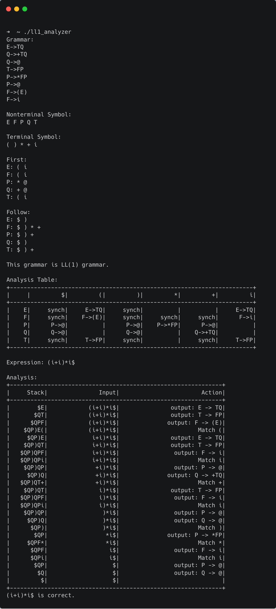

# LL1 Analyzer

This is my Compiler construction course project, a simple LL(1) Grammar Analyzer written in C++.

# Screenshot



# How to use

```bash
git clone https://github.com/LGiki/LL1_analyzer
cd LL1_analyzer
mkdir build
cd build
cmake ../
make
./ll1_analyzer
```